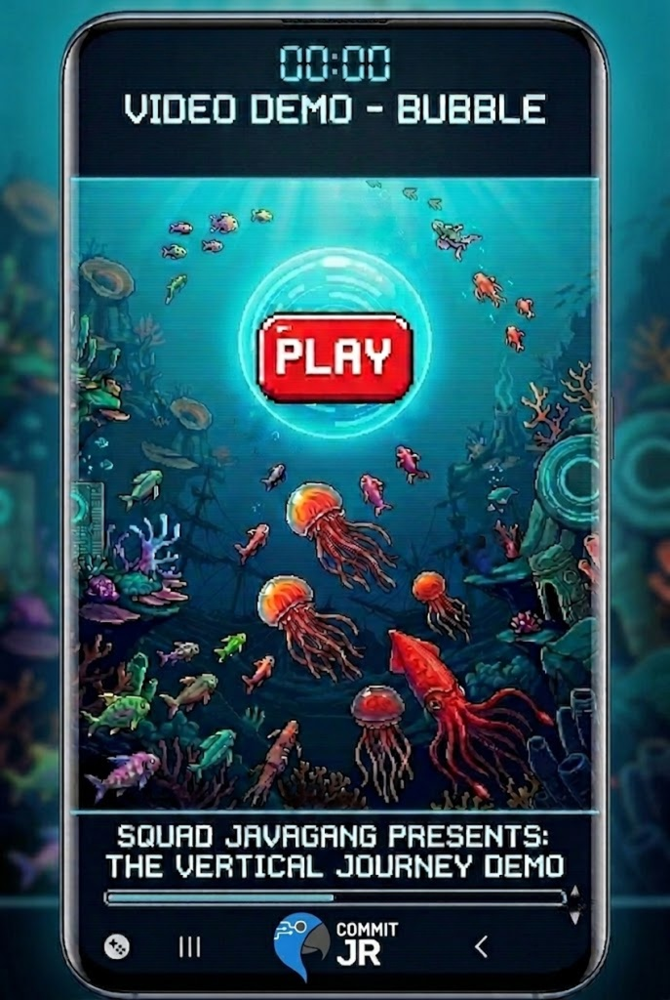

# Bubble

<div align="center">
  
  <br>
  <h1>Bubble</h1>
  <p><strong>Developed by Java Gang 🚀</strong></p>
  
  [](https://play.google.com/store/apps/details?id=com.commitjr.Bubble)
  [](https://github.com/CommitJr/bubble/blob/main/APK.zip)
</div>

---

## 📝 About the Project

In Bubble, you take control of a brave little bubble trying to rise from the deepest parts of the ocean to the surface. Developed by Squad JavaGang from [Commit Júnior](https://commitjr.com/), this captivating arcade game combines precise controls, physics-based movement, and fast-paced survival mechanics in a vibrant underwater world. Along this vertical journey, you will face treacherous currents, marine obstacles, and several aquatic enemies determined to pop you. Your ultimate goal is to guide our beloved bubble safely to the end of its journey.

* **Platform:** Android (Mobile)
* **Tech Stack:** Java / Android Studio
* **Type:** Junior Enterprise Commercial Project / Commit Jr

---

## 🎬 Game Demo

<div align="center">
  <a href="https://www.youtube.com/watch?v=iF4g7Vii75w" target="_blank">
    
  </a>
</div>

---

## 👥 Development Team (Squad JavaGang)

Meet the minds behind the project:

<table align="center">
  <tr>
    <td align="center">
      <a href="https://github.com/pixel-debug">
        <br />
        <sub><b>Marina Diniz</b></sub>
      </a>
    </td>
    <td align="center">
      <a href="https://github.com/matheustheus27">
        <br />
        <sub><b>Matheus Ferreira</b></sub>
      </a>
    </td>
  </tr>
</table>

---

## 📈 Development Analytics

<!--START_SECTION:waka-->
```text
Builds    10  ██████████████  100.00 %